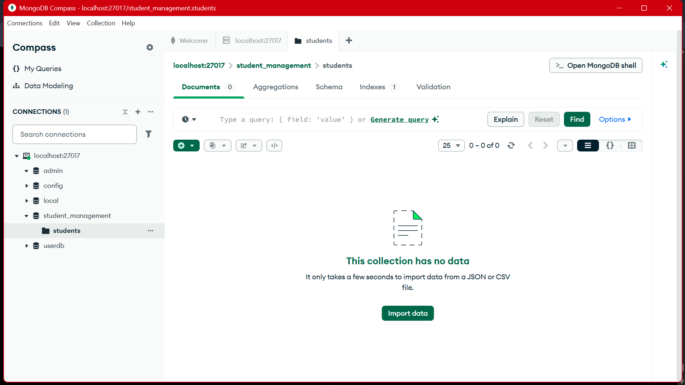
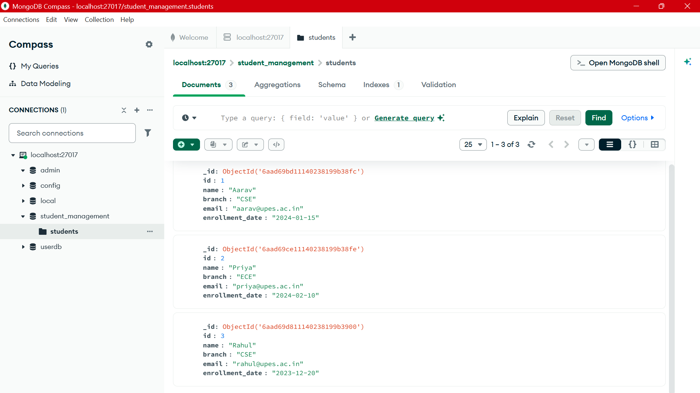
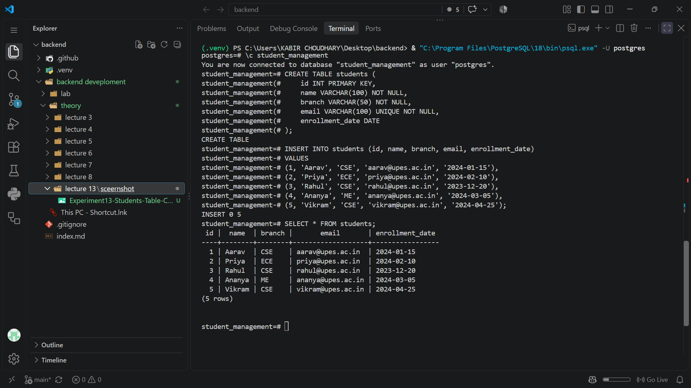
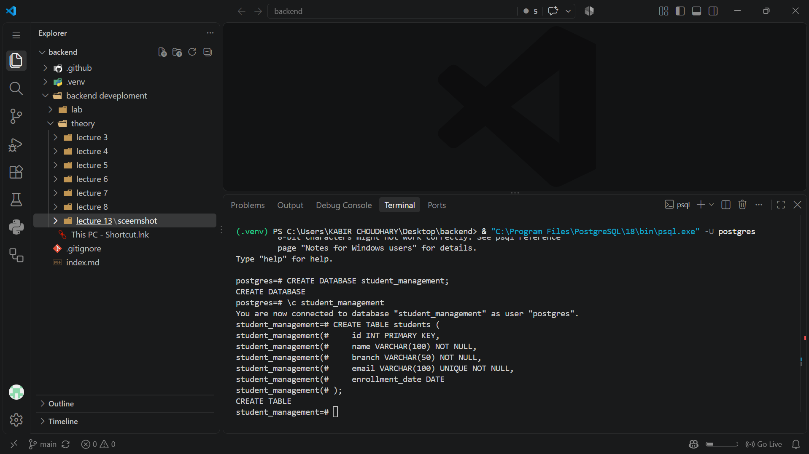
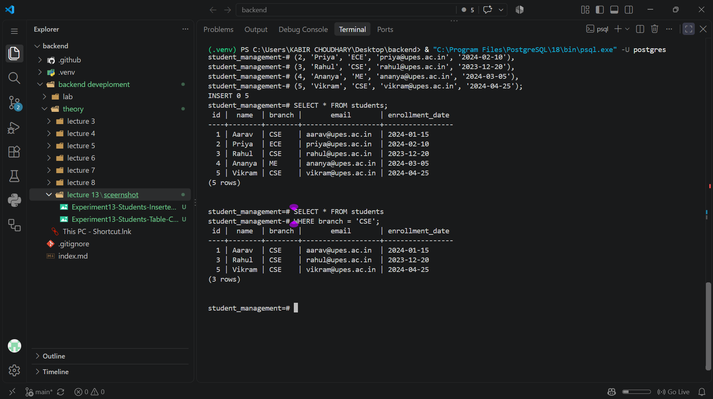
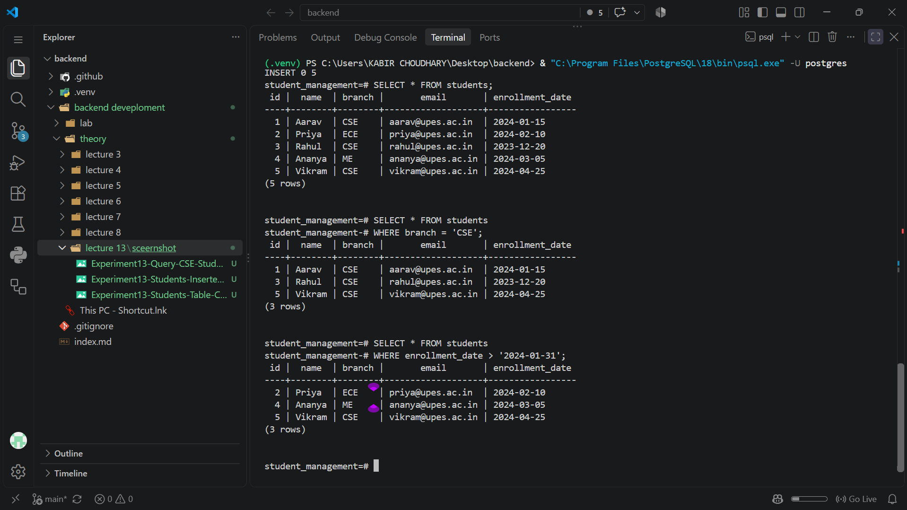
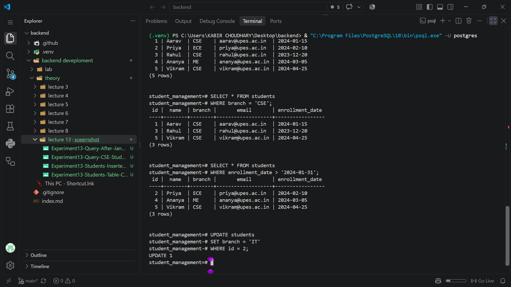
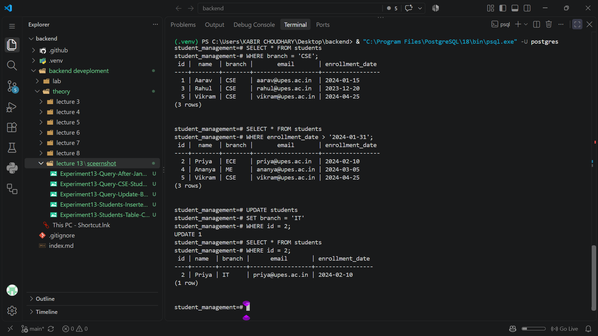
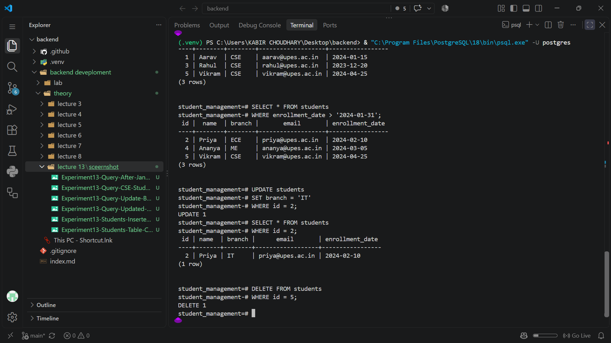
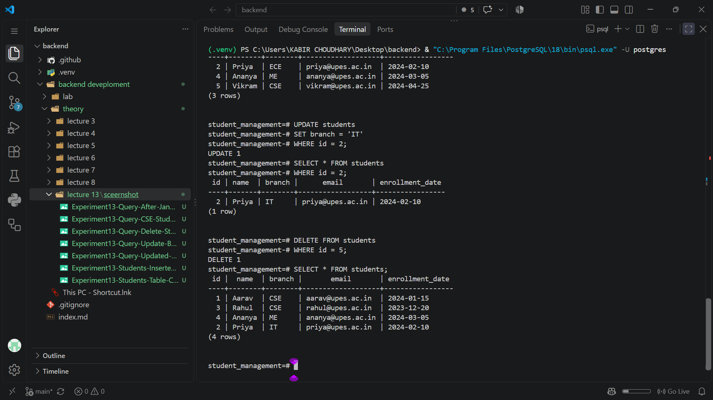

# Lecture 13: MongoDB

**Roll Number:** 590015728

## Objective

To create a MongoDB database and collection, insert student documents, and perform query, update, and delete operations.

## Operations Demonstrated

1. Create the MongoDB database and collection.
2. Insert student documents into the collection.
3. Query students from the CSE branch.
4. Query students admitted after January 2024.
5. Update a student's branch.
6. Delete a student and display the remaining documents.

## Screenshots

### Database and Collection

### Collection Documents

### Inserted Students

### Students Collection Created

### Query CSE Students

### Query Students After January 2024

### Update Student Branch

### Updated Student

### Delete Student

### Remaining Students

